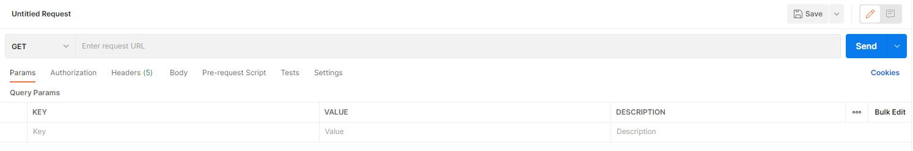

# Today API

Today API is the backend portion meant to be used with [Today, the Project Management App](https://github.com/Yaosaur/Today). In conjunction with the database it is able to take incoming requests from the Today App and register users, log them in, and allow them to create and manage projects and associated tasks with other users.

## RESTFUL Routes

Please note all routes below require the user to be authenticated and if a route returns user information (such as the creator of a project or task) only the email, first name, and last name of the user will be returned to protect users' sensitive information such as password and ids.

### Authentication/User

| VERB | PATH      | DESCRIPTION                                                        |
| ---- | --------- | ------------------------------------------------------------------ |
| POST | /register | Registers a user and assigns them a token which expires in 8 hours |
| POST | /login    | Logs a user in and assigns them a token which expires in 8 hours   |
| GET  | /users    | Returns a list of all users available in the database              |

### Project/Tasks

| VERB   | PATH               | DESCRIPTION                                                                      |
| ------ | ------------------ | -------------------------------------------------------------------------------- |
| GET    | /projects          | Returns a list of all projects available in the database                         |
| GET    | /projects/:id      | Returns a single project based on it's id                                        |
| POST   | /projects          | Creates a new project and return's it's information                              |
| PUT    | /projects/:id      | Edits an existing project and returns the edited project                         |
| DELETE | /projects/:id      | Deletes a project (currently does not delete associated tasks)                   |
| POST   | /projects/:id/task | Creates a new task associated with a single project and returns it's information |

## Built With

- Mongoose
- Express
- Node

## Deployment

This API is currently deployed [here](https://today-project-backend.herokuapp.com/)

Please note since there is no index route ' / ', you will get a error ' Cannot GET / ' when visiting. On other routes, you will receive an 'Unauthorized' response unless logged in.

## Local Installation/Interaction

For you to interact with the program on your local computer, please clone to your IDE using

```
git clone https://github.com/Yaosaur/Today-API
```

After cloning, install the required NPM packages using

```
npm install
```

Finally, create a .env file with the following environmental variables: `PORT`, `MONGO_URI`, and `SECRET`.

### Postman

If you wish to interact with the API, without using the deployed [Today App](https://today-pm.herokuapp.com/), you can use [Postman](https://www.postman.com/) instead. After downloading the desktop version and registering on Postman, under Workspaces, create a new Workspace. Then in the dashboard of the workspace, press new and then HTTP Request on the modal.

You should see a screen for making HTTP Requests. 
Now you can send requests to the local server by entering the URL (ie: 'http://localhost:5000/' or whichever PORT number you choose).

In order to interact with any of the routes, first make a POST request to 'http://localhost:(PORT#)/register'.
Under the Body tab, click the x-www-form-urlencoded option and enter values for these keys: 'firstName, lastName, email, and password'
The request should return a token that you can use and reuse by entering it (the token after the 'Bearer') under the Authorization tab of postman while making subsequent requests.

## Contributing

Currently not accepting any contributors for this project as the backend is still not fully complete.

## Future Plans

- Complete CRUD functionalities for task model
- Add comments model on each task
- Allow image uploading for user avatars and comments
- Add in app messaging between users
